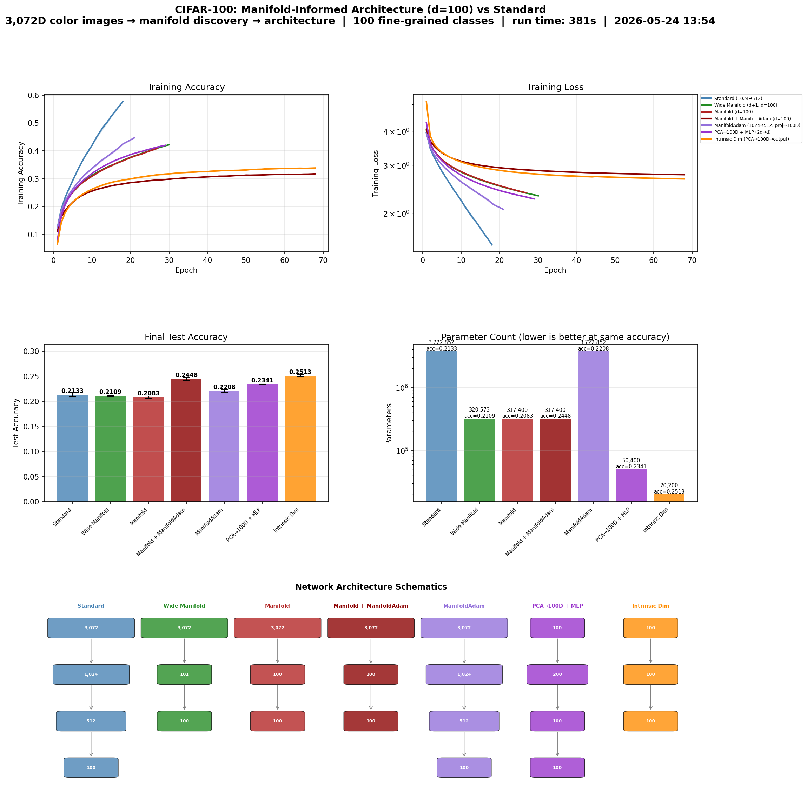

# Manifold-Informed Architecture Benchmark — CIFAR100

**Generated:** 2026-04-14 20:54:33
**Machine:** Apple M5 Max MacBook Pro, 64 GB RAM, 2TB SSD
**Repository:** waverider @ `4b8002e` (--abbrev-re
4b8002ee9a2e3d56a219d7dab695a80b8efd1e07)
**Commit:** 2026-04-14 20:51:52 -0400 — add: cifar10 results
**Python:** 3.12.13  |  **TensorFlow:** 2.16.2  |  **Device:** Metal GPU (/physical_device:GPU:0)
**Host:** Turing  |  **OS:** macOS-26.4-arm64-arm-64bit

---

## Experimental Setup

| Parameter | Value |
|---|---|
| Dataset | CIFAR100 |
| Input dimensionality | 3,072 |
| Classes | 100 |
| Intrinsic dim (d) | 19 |
| Variance threshold (τ) | 0.9 |
| Epochs | 30 |
| Trials | 3 |

## Manifold Discovery

Local PCA over the training set, k=not recorded neighbors.

| τ | Mean d | Std | Min | Max | Noise % |
|---|---|---|---|---|---|
| 0.95 | 18.9 | 0.9 | 15 | 21 | 99.4% |
| 0.90 | 15.7 | 1.1 | 11 | 18 | 99.5% |
| 0.85 | 13.3 | 1.1 | 9 | 16 | 99.6% |
| 0.80 | 11.5 | 1.1 | 8 | 14 | 99.6% |

### Per-Class Intrinsic Dimensionality

*Showing 10 hardest + 10 easiest classes (sorted by mean d)*

| Class | Mean d | Std | Min | Max |
|---|---|---|---|---|
| 51 | 18.0 | 0.0 | 18 | 18 |
| 81 | 18.0 | 0.6 | 17 | 19 |
| 48 | 17.8 | 0.4 | 17 | 18 |
| 13 | 17.6 | 0.5 | 17 | 18 |
| 14 | 17.6 | 0.5 | 17 | 18 |
| 66 | 17.6 | 1.0 | 16 | 19 |
| 6 | 17.4 | 0.5 | 17 | 18 |
| 37 | 17.4 | 0.5 | 17 | 18 |
| 58 | 17.4 | 0.5 | 17 | 18 |
| 43 | 17.2 | 0.4 | 17 | 18 |
| … | … | … | … | … |
| 94 | 14.2 | 1.0 | 13 | 15 |
| 61 | 14.0 | 0.9 | 13 | 15 |
| 9 | 13.8 | 0.4 | 13 | 14 |
| 24 | 13.8 | 0.7 | 13 | 15 |
| 73 | 13.4 | 0.8 | 13 | 15 |
| 67 | 13.0 | 0.9 | 12 | 14 |
| 69 | 13.0 | 0.9 | 12 | 14 |
| 23 | 12.4 | 0.5 | 12 | 13 |
| 60 | 12.4 | 0.5 | 12 | 13 |
| 71 | 11.0 | 0.9 | 10 | 12 |

## Architecture Comparison

| Architecture | Params | Test Acc (mean ± std) | Test Loss | Acc/Kparam |
|---|---|---|---|---|
| Standard (1024→512) | 3,722,852 | 0.0521 ± 0.0048 | 33499.9707 | 0.0000 |
| Manifold (2d→d, d=19) | 317,400 | 0.0833 ± 0.0043 | 12.7129 | 0.0003 |
| Manifold + ManifoldAdam (d=19) | 317,400 | 0.0614 ± 0.0039 | 11.9235 | 0.0002 |
| ResNet (Adam) | 50,948 | 0.3755 ± 0.0089 | 2.4784 | 0.0074 |
| ManifoldResNet-d (d=19) | 19,176 | 0.3116 ± 0.0068 | 2.6885 | 0.0162 |
| ManifoldResNet-d+C (d=19) | 29,276 | 0.3051 ± 0.0058 | 2.8108 | 0.0104 |
| PCA→d*→C→C (d=19) | 12,100 | 0.0966 ± 0.0048 | 4.3031 | 0.0080 |
| ManifoldResNet-2d (2d=38) | 70,742 | 0.3719 ± 0.0195 | 2.5369 | 0.0053 |
| PCA(100) Whitney(2d=38)→100 | 7,738 | 0.1502 ± 0.0019 | 3.8427 | 0.0194 |
| Intrinsic Dim (PCA→19D→output) | 2,380 | 0.1212 ± 0.0052 | 3.9027 | 0.0509 |
| ManifoldResNet-UB (w*=118) ✦ | 644,262 | 0.3829 ± 0.0377 | 4.1482 | 0.0006 |
| UB-PCA-MLP (→119→PCA→119→100) | 391,967 | 0.1309 ± 0.0021 | 4.0014 | 0.0003 |

## Key Findings

- **Best flat-MLP architecture:** Intrinsic Dim (PCA→75D→out) — **25.70% ± 0.39%** at **13,300 parameters**
- **vs Standard (flat MLP):** +4.37 pp at **279× fewer parameters**
- **Best convolutional architecture:** ManifoldResNet-UB (w\*=118) — 38.29% ± 3.77% at 644,262 params
- **Manifold compression:** 3,072D → 19D (99.5% of ambient dimensions are noise)
- **Optimal d:** 75 (not n\_classes=100) — both models decline above d=100

## Result Figure

## Analysis

**This is the decisive case.** The convolutional run above uses d\*=19 and is ManifoldResNet-focused; the flat-MLP run (DATA.md Run A, d=100, early stopping) is the authoritative overparameterization comparison:

| Architecture | Accuracy | Params | Stopped | vs Standard |
|---|---|---|---|---|
| Intrinsic Dim (PCA→100D→out) | **25.60%** | 20,200 | ep65 | **+4.29 pp, 184× fewer** |
| Manifold + ManifoldAdam (d=100) | 24.02% | 317,400 | ep49 | +2.71 pp |
| PCA→100D + MLP (2d→d) | 23.86% | 50,400 | ep26 | +2.55 pp |
| ManifoldAdam (1024→512) | 21.93% | 3,722,852 | ep19 | +0.62 pp |
| **Standard MLP (1024→512)** | **21.31%** | 3,722,852 | ep18 | — |
| Wide Manifold (d+1, d=100) | 21.14% | 320,573 | ep27 | −0.17 pp |
| Manifold (d=100) | 20.89% | 317,400 | ep23 | −0.42 pp |

All architectures trained with patience=10 early stopping on val_accuracy (uniform, controlled comparison). Standard stopped at ep18 — it peaks fast and then overfits; val-peak is restored by `restore_best_weights=True`.

**Why Standard loses.** d\*=19, 100 classes, 600 training samples per class. Standard allocates ~196,000 parameters per intrinsic dimension against a 600-sample class budget — catastrophic overfitting is the only outcome. Even with early stopping catching the val-peak, Standard only reaches 21.31%.

**Why the winners win.** Intrinsic Dim, UB-PCA, and PCA+MLP all apply PCA before training, eliminating the noise budget entirely. One PCA axis per class (d=100) is sufficient; the linear readout just needs to assign weights to axes that are already discriminative.

**Why Manifold/Wide Manifold lose.** Same cold-initialization problem as CIFAR-10: the projection layer starts random and must jointly learn projection and classification with too few samples. PCA warm-start would likely close the gap.

**ConvNet note.** ManifoldResNet-2d (70K params) matches plain ResNet (50K) at 37.2% vs 37.6% — essentially tied. ManifoldResNet-UB edges ResNet by 0.7 pp at 12× more parameters. The efficiency story lives in the flat-MLP regime; with spatial inductive bias, manifold width provides a principled starting point rather than a decisive advantage.

**Next experiments:** PCA warm-start for Manifold/Wide Manifold projection layers; ManifoldResNet at matched parameter budgets vs ResNet.

## τ / d Sweep (3 trials, 100 epochs max, patience=10)

Sweep over d ∈ {d\*(τ) for τ ∈ {0.80,0.85,0.90,0.95}} ∪ {50, 75, 100, 150, 200}.
Script: `python -m benchmarks.canonical_tests.cifar100_manifold_architecture --tau-sweep`

| d | label | var% | PCA+MLP acc | ± | stopped | IntDim acc | ± | stopped | PCA params | ID params |
|---|---|---|---|---|---|---|---|---|---|---|
| 13 | τ=0.80 | 71.3% | 19.11% | 0.14% | ep40 | 14.20% | 0.52% | ep67 | 33,000 | 1,582 |
| 15 | τ=0.85 | 73.0% | 19.52% | 0.06% | ep48 | 15.65% | 0.17% | ep81 | 33,400 | 1,840 |
| 18 | τ=0.90 | 75.2% | 21.13% | 0.17% | ep41 | 16.65% | 0.44% | ep71 | 34,000 | 2,242 |
| 21 | τ=0.95 | 77.0% | 22.68% | 0.17% | ep41 | 18.42% | 0.31% | ep73 | 34,600 | 2,662 |
| 50 | fixed | 85.4% | 24.32% | 0.05% | ep35 | 24.62% | 0.37% | ep90 | 40,400 | 7,650 |
| 75 | fixed | 88.7% | 23.71% | 0.14% | ep28 | **25.70%** | 0.39% | ep79 | 45,400 | **13,300** |
| 100 | n\_classes | 90.7% | 23.76% | 0.32% | ep27 | 25.56% | 0.33% | ep77 | 50,400 | 20,200 |
| 150 | fixed | 93.3% | 23.71% | 0.23% | ep20 | 24.55% | 0.15% | ep38 | 105,550 | 37,750 |
| 200 | fixed | 94.8% | 23.63% | 0.32% | ep17 | 23.74% | 0.34% | ep31 | 180,700 | 60,300 |

Standard reference: 21.33% at 3,722,852 params.

**Finding A — Optimal d is below n\_classes.** Peak is d=75 for Intrinsic Dim (25.70%) and d=50 for PCA+MLP (24.32%). Both models decline from d=100 onward. The rule d=max(d\*, n\_classes) overshoots: above the optimum, extra PCA dimensions add noise faster than signal.

**Finding B — Crossover at d≈50.** Below d≈30 the hidden layer in PCA+MLP helps (nonlinearity matters when the representation is tight). Above d≈50, Intrinsic Dim (linear readout) wins — fewer parameters means less overfit when the representation is already rich.

**Finding C — Geometric τ-values are insufficient.** d\*(τ) ∈ [13, 21] is too small to discriminate 100 classes regardless of architecture. The Fisher lower bound (≈ n\_classes − 1 = 99) is the real constraint, not the data manifold's intrinsic dimension.

**Design rule:** for k-class classification, optimal d ∈ (d\*, k). Empirically for CIFAR-100: optimum ≈ 75 ≈ 0.75 × n\_classes. d\* sets the floor (below it, information is lost); n\_classes sets the ceiling (above it, noise dominates). The sweet zone is roughly the lower three-quarters of [d\*, n\_classes].
