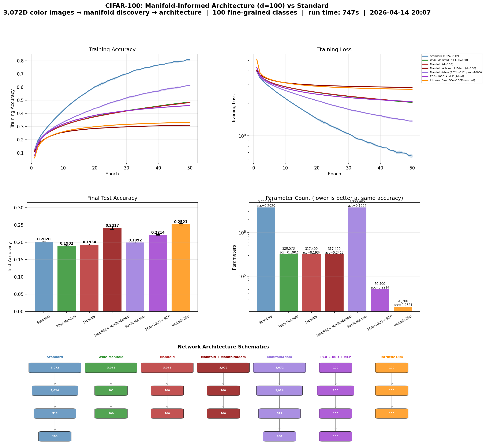

# Manifold-Informed Architecture Benchmark — CIFAR100

**Generated:** 2026-08-04 03:29:45  
**Machine:** Apple M5 Max MacBook Pro, 64 GB RAM, 2TB SSD  
**Repository:** waverider @ `3c5d283` (--abbrev-re
3c5d28344fd5c5ace0b3399593d61b40363afcda)  
**Commit:** 2026-08-04 03:22:44 +0000 — docs(readme): add holographic-rendering Breaking News section; audit fixes  
**Python:** 3.12.3  |  **TensorFlow:** 2.21.0  |  **Device:** CPU  
**Host:** vm  |  **OS:** Linux-6.18.5-fc-v18-x86_64-with-glibc2.39

---

## Experimental Setup

| Parameter | Value |
|---|---|
| Dataset | CIFAR100 |
| Input dimensionality | 3,072 |
| Classes | 100 |
| Intrinsic dim (d) | 19 |
| Variance threshold (τ) | 0.9 |
| Epochs | 100 |
| Trials | 3 |
| Batch size | 256 |
| Learning rate | 0.001 |

## Manifold Discovery

Local PCA over the training set, k=25 neighbors.

| τ | Mean d | Std | Min | Max | Noise % |
|---|---|---|---|---|---|
| 0.95 | 18.9 | 1.0 | 15 | 21 | 99.4% |
| 0.90 | 15.7 | 1.1 | 11 | 18 | 99.5% |
| 0.85 | 13.3 | 1.1 | 9 | 15 | 99.6% |
| 0.80 | 11.4 | 1.1 | 7 | 14 | 99.6% |

### Per-Class Intrinsic Dimensionality

*Showing 10 hardest + 10 easiest classes (sorted by mean d)*

| Class | Mean d | Std | Min | Max |
|---|---|---|---|---|
| motorcycle | 18.1 | 0.5 | 17 | 19 |
| bus | 17.7 | 0.5 | 17 | 18 |
| butterfly | 17.6 | 0.7 | 16 | 18 |
| house | 17.6 | 0.5 | 17 | 18 |
| poppy | 17.6 | 0.5 | 17 | 18 |
| pickup_truck | 17.5 | 0.5 | 17 | 18 |
| tiger | 17.5 | 0.7 | 16 | 18 |
| mushroom | 17.2 | 1.0 | 16 | 19 |
| orchid | 17.1 | 0.9 | 15 | 18 |
| raccoon | 17.1 | 0.8 | 16 | 18 |
| … | … | … | … | … |
| plate | 14.1 | 0.8 | 12 | 15 |
| apple | 14.0 | 1.3 | 12 | 16 |
| bottle | 14.0 | 0.4 | 13 | 15 |
| cup | 13.7 | 0.8 | 13 | 15 |
| ray | 13.5 | 0.8 | 12 | 15 |
| shark | 13.0 | 0.4 | 12 | 14 |
| rocket | 12.8 | 0.6 | 12 | 14 |
| cloud | 12.4 | 1.1 | 10 | 14 |
| plain | 12.1 | 0.9 | 11 | 14 |
| sea | 11.3 | 0.8 | 10 | 12 |

## Architecture Comparison

| Architecture | Params | Test Acc (mean ± std) | Test Loss | Acc/Kparam |
|---|---|---|---|---|
| Standard (1024→512) | 3,722,852 | 0.2131 ± 0.0028 | 3.7730 | 0.0001 |
| Wide Manifold (d+1, d=100) | 320,573 | 0.2114 ± 0.0033 | 3.6483 | 0.0007 |
| Manifold (d=100) | 317,400 | 0.2089 ± 0.0019 | 3.5762 | 0.0007 |
| Manifold + ManifoldAdam (d=100) | 317,400 | 0.2402 ± 0.0064 | 3.2974 | 0.0008 |
| ManifoldAdam (1024→512, proj→100D) | 3,722,852 | 0.2193 ± 0.0010 | 3.5856 | 0.0001 |
| PCA→100D + MLP (2d→d) | 50,400 | 0.2386 ± 0.0035 | 3.3877 | 0.0047 |
| Intrinsic Dim (PCA→100D→output) ✦ | 20,200 | 0.2560 ± 0.0012 | 3.2191 | 0.0127 |

## Key Findings

- **Best architecture:** Intrinsic Dim (PCA→100D→output)
  — test accuracy 0.2560 ± 0.0012
- **vs Standard:** +0.0429 (4.29 pp) accuracy gain
- **Parameter reduction:** 184.3× fewer parameters (20,200 vs 3,722,852)
- **Parameter efficiency:** 0.0127 acc/Kparam vs 0.0001 for Standard (221.4× improvement)
- **Manifold compression:** 3,072D → 19D (99.4% of ambient dimensions are noise)

## Result Figure

