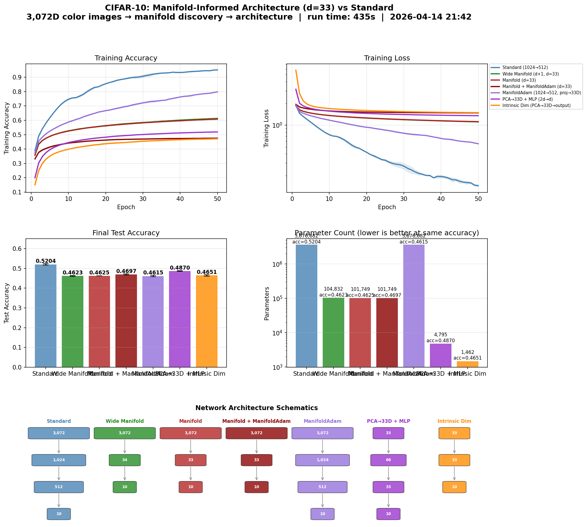

# Manifold-Informed Architecture Benchmark — CIFAR10

**Generated:** 2026-04-14 21:43:29
**Machine:** Apple M5 Max MacBook Pro, 64 GB RAM, 2TB SSD
**Repository:** waverider @ `4b8002e` (--abbrev-re
4b8002ee9a2e3d56a219d7dab695a80b8efd1e07)
**Commit:** 2026-04-14 20:51:52 -0400 — add: cifar10 results
**Python:** 3.12.13  |  **TensorFlow:** 2.21.0  |  **Device:** CPU (forced)
**Host:** Turing  |  **OS:** macOS-26.4-arm64-arm-64bit

---

## Experimental Setup

| Parameter | Value |
|---|---|
| Dataset | CIFAR10 |
| Input dimensionality | 3,072 |
| Classes | 10 |
| Intrinsic dim (d) | 33 |
| Variance threshold (τ) | 0.9 |
| Epochs | 50 |
| Trials | 3 |
| Batch size | 512 |
| Learning rate | 0.001 |

## Manifold Discovery

Local PCA over the training set, k=50 neighbors.

| τ | Mean d | Std | Min | Max | Noise % |
|---|---|---|---|---|---|
| 0.95 | 36.0 | 1.6 | 29 | 40 | 98.8% |
| 0.90 | 28.8 | 1.7 | 22 | 33 | 99.1% |
| 0.85 | 23.7 | 1.7 | 17 | 28 | 99.2% |
| 0.80 | 19.7 | 1.6 | 13 | 24 | 99.4% |

### Per-Class Intrinsic Dimensionality

| Class | Mean d | Std | Min | Max |
|---|---|---|---|---|
| automobile | 31.9 | 0.9 | 30 | 33 |
| frog | 31.6 | 1.2 | 29 | 33 |
| truck | 31.4 | 1.3 | 29 | 33 |
| horse | 30.7 | 1.0 | 29 | 32 |
| deer | 29.5 | 1.0 | 28 | 31 |
| cat | 29.1 | 0.8 | 28 | 31 |
| dog | 28.7 | 1.1 | 27 | 30 |
| bird | 28.0 | 2.4 | 23 | 30 |
| airplane | 25.9 | 1.1 | 24 | 28 |
| ship | 25.3 | 1.7 | 24 | 29 |

## Architecture Comparison

| Architecture | Params | Test Acc (mean ± std) | Test Loss | Acc/Kparam |
|---|---|---|---|---|
| Standard (1024→512) | 3,676,682 | 0.5204 ± 0.0033 | 4.0487 | 0.0001 |
| Wide Manifold (d+1, d=33) | 104,832 | 0.4623 ± 0.0021 | 1.6255 | 0.0044 |
| Manifold (d=33) | 101,749 | 0.4625 ± 0.0005 | 1.6351 | 0.0045 |
| Manifold + ManifoldAdam (d=33) | 101,749 | 0.4697 ± 0.0023 | 1.5020 | 0.0046 |
| ManifoldAdam (1024→512, proj→33D) | 3,676,682 | 0.4615 ± 0.0040 | 2.8986 | 0.0001 |
| PCA→33D + MLP (2d→d) | 4,795 | 0.4870 ± 0.0018 | 1.4540 | 0.1016 |
| Intrinsic Dim (PCA→33D→output) | 1,462 | 0.4651 ± 0.0036 | 1.5068 | 0.3181 |

## Key Findings

- **Best architecture:** Standard (1024→512)
  — test accuracy 0.5204 ± 0.0033
- **Manifold compression:** 3,072D → 33D (98.9% of ambient dimensions are noise)

## Result Figure

