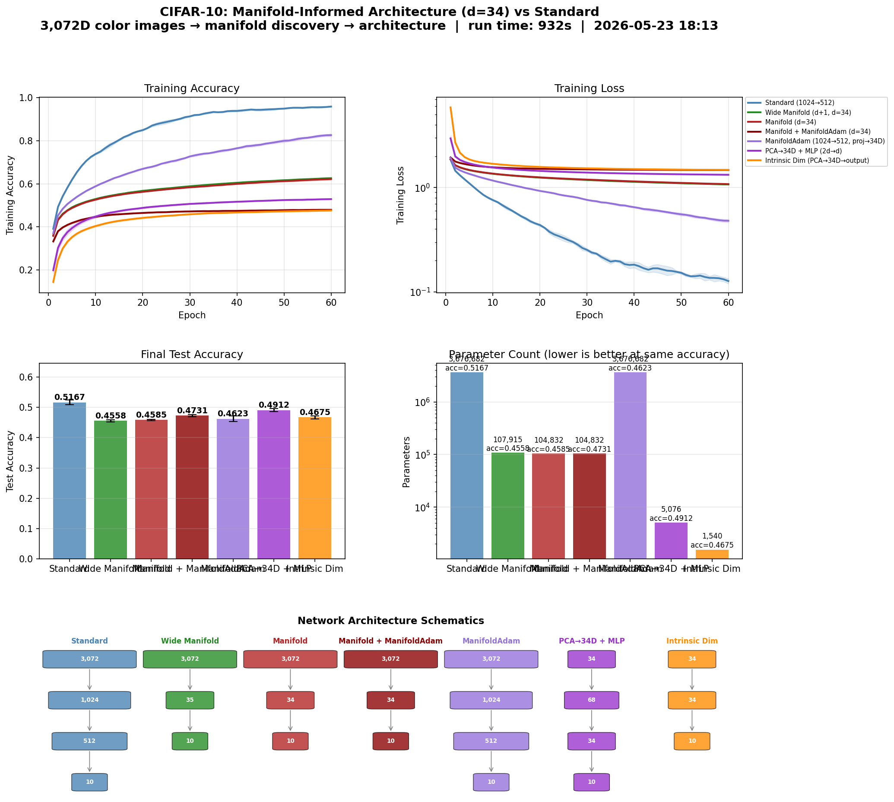

# Manifold-Informed Architecture Benchmark — CIFAR10

**Generated:** 2026-08-04 03:29:24  
**Machine:** Apple M5 Max MacBook Pro, 64 GB RAM, 2TB SSD  
**Repository:** waverider @ `3c5d283` (--abbrev-re
3c5d28344fd5c5ace0b3399593d61b40363afcda)  
**Commit:** 2026-08-04 03:22:44 +0000 — docs(readme): add holographic-rendering Breaking News section; audit fixes  
**Python:** 3.12.3  |  **TensorFlow:** 2.21.0  |  **Device:** CPU (forced)  
**Host:** vm  |  **OS:** Linux-6.18.5-fc-v18-x86_64-with-glibc2.39

---

## Experimental Setup

| Parameter | Value |
|---|---|
| Dataset | CIFAR10 |
| Input dimensionality | 3,072 |
| Classes | 10 |
| Intrinsic dim (d) | 34 |
| Variance threshold (τ) | 0.9 |
| Epochs | 60 |
| Trials | 5 |
| Batch size | 512 |
| Learning rate | 0.001 |

## Manifold Discovery

Local PCA over the training set, k=50 neighbors.

| τ | Mean d | Std | Min | Max | Noise % |
|---|---|---|---|---|---|
| 0.95 | 36.0 | 1.8 | 24 | 40 | 98.8% |
| 0.90 | 28.8 | 1.9 | 18 | 33 | 99.1% |
| 0.85 | 23.6 | 1.9 | 14 | 28 | 99.2% |
| 0.80 | 19.6 | 1.8 | 11 | 24 | 99.4% |

### Per-Class Intrinsic Dimensionality

| Class | Mean d | Std | Min | Max |
|---|---|---|---|---|
| frog | 31.6 | 1.8 | 28 | 33 |
| truck | 31.4 | 1.6 | 28 | 34 |
| horse | 31.1 | 0.8 | 30 | 33 |
| automobile | 30.8 | 2.2 | 25 | 33 |
| deer | 29.2 | 1.5 | 28 | 32 |
| dog | 28.4 | 0.8 | 27 | 30 |
| cat | 27.8 | 1.0 | 26 | 29 |
| bird | 27.7 | 2.1 | 25 | 31 |
| airplane | 26.5 | 1.2 | 25 | 29 |
| ship | 25.6 | 1.6 | 22 | 27 |

## Architecture Comparison

| Architecture | Params | Test Acc (mean ± std) | Test Loss | Acc/Kparam |
|---|---|---|---|---|
| Standard (1024→512) | 3,676,682 | 0.5167 ± 0.0075 | 4.4642 | 0.0001 |
| Wide Manifold (d+1, d=34) | 107,915 | 0.4558 ± 0.0038 | 1.6858 | 0.0042 |
| Manifold (d=34) | 104,832 | 0.4585 ± 0.0026 | 1.6821 | 0.0044 |
| Manifold + ManifoldAdam (d=34) | 104,832 | 0.4731 ± 0.0035 | 1.4881 | 0.0045 |
| ManifoldAdam (1024→512, proj→34D) | 3,676,682 | 0.4623 ± 0.0094 | 3.3072 | 0.0001 |
| PCA→34D + MLP (2d→d) | 5,076 | 0.4912 ± 0.0046 | 1.4503 | 0.0968 |
| Intrinsic Dim (PCA→34D→output) | 1,540 | 0.4675 ± 0.0051 | 1.4954 | 0.3036 |

## Key Findings

- **Best architecture:** Standard (1024→512)
  — test accuracy 0.5167 ± 0.0075
- **Manifold compression:** 3,072D → 34D (98.9% of ambient dimensions are noise)

## Result Figure

