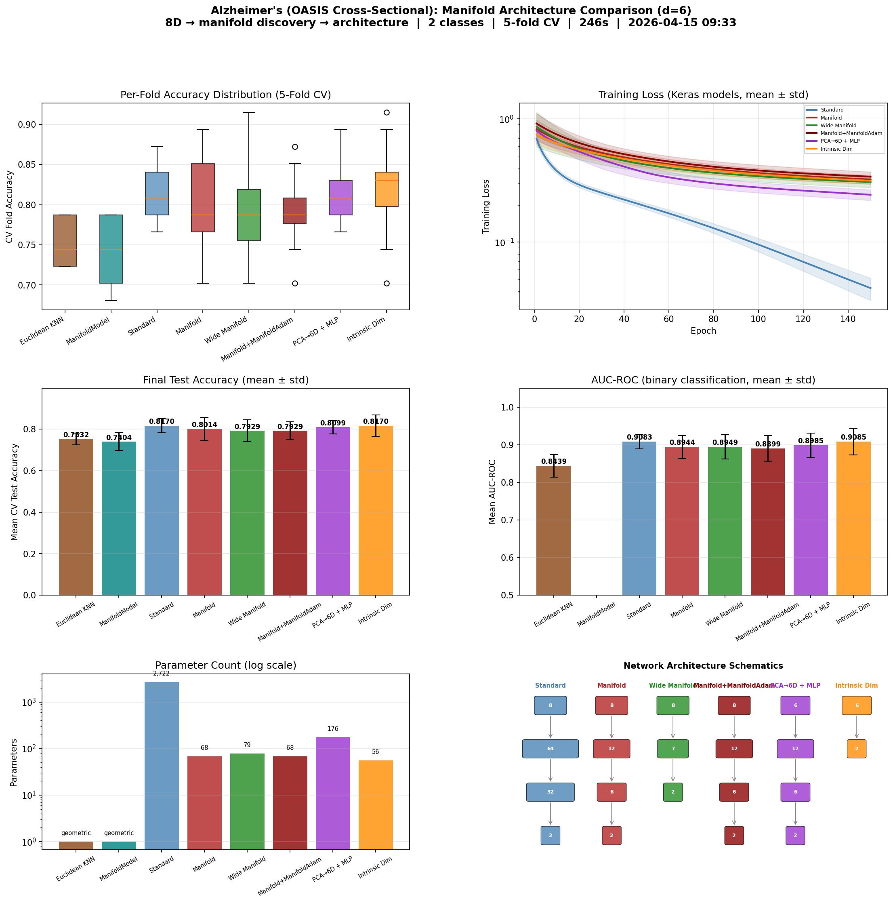

# Manifold-Informed Architecture Benchmark — ALZHEIMERS

**Generated:** 2026-04-15 09:41:10
**Machine:** Apple M5 Max MacBook Pro, 64 GB RAM, 2TB SSD
**Repository:** waverider @ `054030a` (--abbrev-re
054030a600978c0e9ffac58faf7157939927d009)
**Commit:** 2026-04-14 22:20:05 -0400 — chore(release): bump version to 0.6.0
**Python:** 3.12.13  |  **TensorFlow:** 2.21.0  |  **Device:** CPU (forced)
**Host:** Turing  |  **OS:** macOS-26.4-arm64-arm-64bit

---

## Experimental Setup

| Parameter | Value |
|---|---|
| Dataset | ALZHEIMERS |
| Input dimensionality | 8 |
| Classes | 2 |
| Intrinsic dim (d) | 6 |
| Variance threshold (τ) | 0.9 |
| Epochs | 150 |
| Trials | 3 |
| Batch size | 32 |
| Learning rate | 0.001 |

## Manifold Discovery

Local PCA over the training set, k=20 neighbors.

| τ | Mean d | Std | Min | Max | Noise % |
|---|---|---|---|---|---|
| 0.95 | 5.3 | 0.5 | 4 | 6 | 34.2% |
| 0.90 | 4.6 | 0.5 | 4 | 6 | 42.6% |
| 0.85 | 4.0 | 0.4 | 3 | 5 | 49.5% |
| 0.80 | 3.6 | 0.5 | 3 | 5 | 54.9% |

### Per-Class Intrinsic Dimensionality

| Class | Mean d | Std | Min | Max |
|---|---|---|---|---|
| 1 | 5.0 | 0.3 | 4 | 6 |
| 0 | 4.2 | 0.4 | 4 | 5 |

## Architecture Comparison

| Architecture | Params | Test Acc (mean ± std) | Test Loss | Acc/Kparam |
|---|---|---|---|---|
| Euclidean KNN (k=7) | 0 | 0.7532 ± 0.0289 | N/A | N/A |
| ManifoldModel (τ=0.9) | 0 | 0.7404 ± 0.0434 | N/A | N/A |
| Standard (64→32) | 2,722 | 0.8170 ± 0.0337 | 0.6774 | 0.3002 |
| Manifold (2d→d, d=6) | 68 | 0.8014 ± 0.0558 | 0.4074 | 11.7856 |
| Wide Manifold (d+1=7) | 79 | 0.7929 ± 0.0518 | 0.4058 | 10.0368 |
| Manifold+ManifoldAdam (d=6) | 68 | 0.7929 ± 0.0422 | 0.4199 | 11.6604 |
| PCA→6D + MLP (2d→d) | 176 | 0.8099 ± 0.0325 | 0.4157 | 4.6019 |
| Intrinsic Dim (PCA→6D→C) | 56 | 0.8170 ± 0.0520 | 0.3789 | 14.5897 |

## Key Findings

- **Best architecture:** Standard (64→32)
  — test accuracy 0.8170 ± 0.0337
- **Manifold compression:** 8D → 6D (25.0% of ambient dimensions are noise)

## Result Figure

