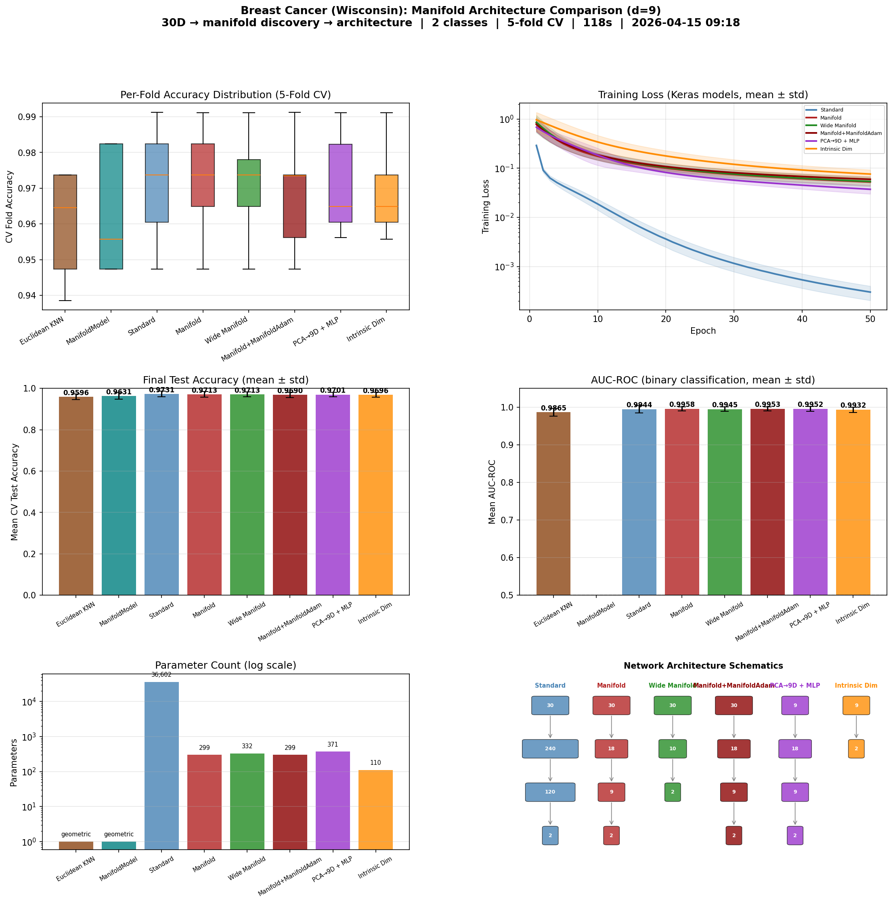

# Manifold-Informed Architecture Benchmark — BREAST_CANCER

**Generated:** 2026-04-15 09:41:11
**Machine:** Apple M5 Max MacBook Pro, 64 GB RAM, 2TB SSD
**Repository:** waverider @ `054030a` (--abbrev-re
054030a600978c0e9ffac58faf7157939927d009)
**Commit:** 2026-04-14 22:20:05 -0400 — chore(release): bump version to 0.6.0
**Python:** 3.12.13  |  **TensorFlow:** 2.21.0  |  **Device:** CPU (forced)
**Host:** Turing  |  **OS:** macOS-26.4-arm64-arm-64bit

---

## Experimental Setup

| Parameter | Value |
|---|---|
| Dataset | BREAST_CANCER |
| Input dimensionality | 30 |
| Classes | 2 |
| Intrinsic dim (d) | 9 |
| Variance threshold (τ) | 0.9 |
| Epochs | 50 |
| Trials | 3 |
| Batch size | 32 |
| Learning rate | 0.001 |

## Manifold Discovery

Local PCA over the training set, k=40 neighbors.

| τ | Mean d | Std | Min | Max | Noise % |
|---|---|---|---|---|---|
| 0.95 | 10.4 | 0.5 | 9 | 12 | 65.2% |
| 0.90 | 8.2 | 0.6 | 7 | 10 | 72.5% |
| 0.85 | 6.9 | 0.6 | 5 | 8 | 77.1% |
| 0.80 | 5.9 | 0.5 | 4 | 7 | 80.2% |

### Per-Class Intrinsic Dimensionality

| Class | Mean d | Std | Min | Max |
|---|---|---|---|---|
| 1 | 8.4 | 0.6 | 7 | 9 |
| 0 | 7.8 | 0.5 | 7 | 9 |

## Architecture Comparison

| Architecture | Params | Test Acc (mean ± std) | Test Loss | Acc/Kparam |
|---|---|---|---|---|
| Euclidean KNN (k=7) | 0 | 0.9596 ± 0.0142 | N/A | N/A |
| ManifoldModel (τ=0.9) | 0 | 0.9631 ± 0.0161 | N/A | N/A |
| Standard (240→120) | 36,602 | 0.9731 ± 0.0141 | 0.1552 | 0.0266 |
| Manifold (2d→d, d=9) | 299 | 0.9713 ± 0.0134 | 0.0808 | 3.2486 |
| Wide Manifold (d+1=10) | 332 | 0.9713 ± 0.0117 | 0.0864 | 2.9257 |
| Manifold+ManifoldAdam (d=9) | 299 | 0.9690 ± 0.0127 | 0.0882 | 3.2407 |
| PCA→9D + MLP (2d→d) | 371 | 0.9701 ± 0.0114 | 0.0839 | 2.6150 |
| Intrinsic Dim (PCA→9D→C) | 110 | 0.9696 ± 0.0115 | 0.1020 | 8.8141 |

## Key Findings

- **Best architecture:** Standard (240→120)
  — test accuracy 0.9731 ± 0.0141
- **Manifold compression:** 30D → 9D (70.0% of ambient dimensions are noise)

## Result Figure

