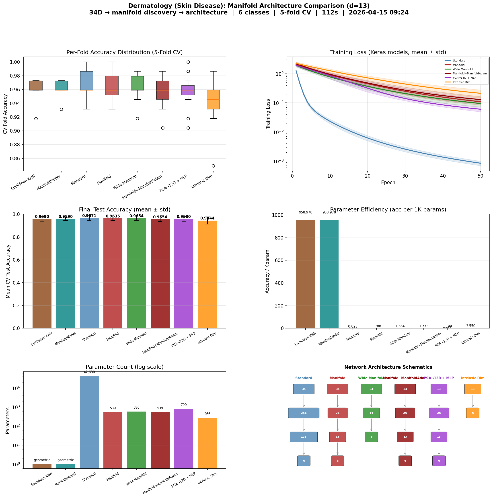

# Manifold-Informed Architecture Benchmark — DERMATOLOGY

**Generated:** 2026-04-15 09:41:13
**Machine:** Apple M5 Max MacBook Pro, 64 GB RAM, 2TB SSD
**Repository:** waverider @ `054030a` (--abbrev-re
054030a600978c0e9ffac58faf7157939927d009)
**Commit:** 2026-04-14 22:20:05 -0400 — chore(release): bump version to 0.6.0
**Python:** 3.12.13  |  **TensorFlow:** 2.21.0  |  **Device:** CPU (forced)
**Host:** Turing  |  **OS:** macOS-26.4-arm64-arm-64bit

---

## Experimental Setup

| Parameter | Value |
|---|---|
| Dataset | DERMATOLOGY |
| Input dimensionality | 34 |
| Classes | 6 |
| Intrinsic dim (d) | 13 |
| Variance threshold (τ) | 0.9 |
| Epochs | 50 |
| Trials | 3 |
| Batch size | 32 |
| Learning rate | 0.001 |

## Manifold Discovery

Local PCA over the training set, k=40 neighbors.

| τ | Mean d | Std | Min | Max | Noise % |
|---|---|---|---|---|---|
| 0.95 | 13.9 | 1.4 | 11 | 17 | 59.2% |
| 0.90 | 11.4 | 1.2 | 8 | 13 | 66.6% |
| 0.85 | 9.7 | 1.2 | 6 | 12 | 71.6% |
| 0.80 | 8.4 | 1.1 | 4 | 10 | 75.2% |

### Per-Class Intrinsic Dimensionality

| Class | Mean d | Std | Min | Max |
|---|---|---|---|---|
| 2 | 12.6 | 0.5 | 12 | 13 |
| 0 | 12.2 | 0.5 | 11 | 13 |
| 4 | 10.5 | 0.5 | 10 | 11 |
| 1 | 10.2 | 0.4 | 10 | 11 |
| 3 | 10.1 | 0.5 | 9 | 11 |
| 5 | 8.0 | 0.0 | 8 | 8 |

## Architecture Comparison

| Architecture | Params | Test Acc (mean ± std) | Test Loss | Acc/Kparam |
|---|---|---|---|---|
| Euclidean KNN (k=7) | 0 | 0.9590 ± 0.0213 | N/A | N/A |
| ManifoldModel (τ=0.9) | 0 | 0.9590 ± 0.0151 | N/A | N/A |
| Standard (256→128) | 42,630 | 0.9671 ± 0.0205 | 0.0918 | 0.0227 |
| Manifold (2d→d, d=13) | 539 | 0.9635 ± 0.0198 | 0.1380 | 1.7876 |
| Wide Manifold (d+1=14) | 580 | 0.9654 ± 0.0186 | 0.1303 | 1.6644 |
| Manifold+ManifoldAdam (d=13) | 539 | 0.9554 ± 0.0202 | 0.1547 | 1.7725 |
| PCA→13D + MLP (2d→d) | 799 | 0.9580 ± 0.0237 | 0.1072 | 1.1990 |
| Intrinsic Dim (PCA→13D→C) | 266 | 0.9444 ± 0.0322 | 0.2374 | 3.5504 |

## Key Findings

- **Best architecture:** Standard (256→128)
  — test accuracy 0.9671 ± 0.0205
- **Manifold compression:** 34D → 13D (61.8% of ambient dimensions are noise)

## Result Figure

