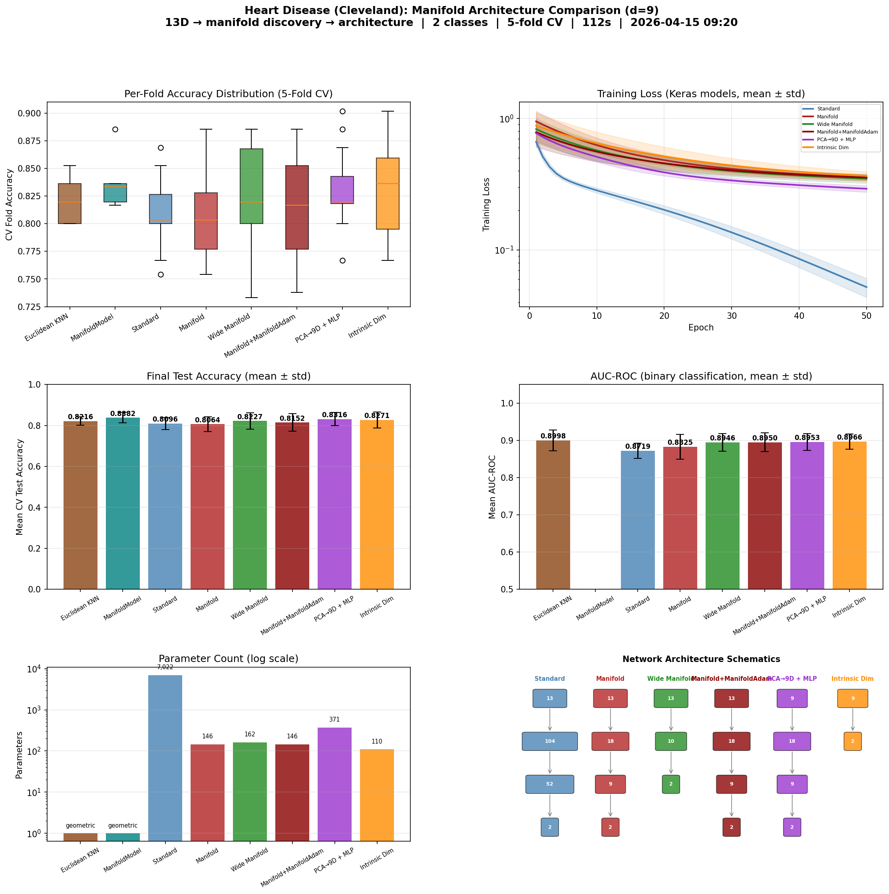

# Manifold-Informed Architecture Benchmark — HEART

**Generated:** 2026-04-15 09:41:12
**Machine:** Apple M5 Max MacBook Pro, 64 GB RAM, 2TB SSD
**Repository:** waverider @ `054030a` (--abbrev-re
054030a600978c0e9ffac58faf7157939927d009)
**Commit:** 2026-04-14 22:20:05 -0400 — chore(release): bump version to 0.6.0
**Python:** 3.12.13  |  **TensorFlow:** 2.21.0  |  **Device:** CPU (forced)
**Host:** Turing  |  **OS:** macOS-26.4-arm64-arm-64bit

---

## Experimental Setup

| Parameter | Value |
|---|---|
| Dataset | HEART |
| Input dimensionality | 13 |
| Classes | 2 |
| Intrinsic dim (d) | 9 |
| Variance threshold (τ) | 0.9 |
| Epochs | 50 |
| Trials | 3 |
| Batch size | 32 |
| Learning rate | 0.001 |

## Manifold Discovery

Local PCA over the training set, k=40 neighbors.

| τ | Mean d | Std | Min | Max | Noise % |
|---|---|---|---|---|---|
| 0.95 | 9.8 | 0.7 | 8 | 11 | 24.3% |
| 0.90 | 8.3 | 0.6 | 7 | 10 | 35.9% |
| 0.85 | 7.2 | 0.6 | 6 | 8 | 44.3% |
| 0.80 | 6.4 | 0.6 | 5 | 7 | 50.9% |

### Per-Class Intrinsic Dimensionality

| Class | Mean d | Std | Min | Max |
|---|---|---|---|---|
| 1 | 8.6 | 0.5 | 8 | 9 |
| 0 | 8.1 | 0.7 | 7 | 9 |

## Architecture Comparison

| Architecture | Params | Test Acc (mean ± std) | Test Loss | Acc/Kparam |
|---|---|---|---|---|
| Euclidean KNN (k=7) | 0 | 0.8216 ± 0.0205 | N/A | N/A |
| ManifoldModel (τ=0.9) ✦ | 0 | 0.8382 ± 0.0247 | N/A | N/A |
| Standard (104→52) | 7,022 | 0.8096 ± 0.0291 | 0.6827 | 0.1153 |
| Manifold (2d→d, d=9) | 146 | 0.8064 ± 0.0359 | 0.4295 | 5.5231 |
| Wide Manifold (d+1=10) | 162 | 0.8227 ± 0.0401 | 0.4103 | 5.0785 |
| Manifold+ManifoldAdam (d=9) | 146 | 0.8152 ± 0.0436 | 0.4036 | 5.5836 |
| PCA→9D + MLP (2d→d) | 371 | 0.8316 ± 0.0331 | 0.4102 | 2.2414 |
| Intrinsic Dim (PCA→9D→C) | 110 | 0.8271 ± 0.0393 | 0.4055 | 7.5191 |

## Key Findings

- **Best architecture:** ManifoldModel (τ=0.9)
  — test accuracy 0.8382 ± 0.0247
- **vs Standard:** +0.0286 (2.86 pp) accuracy gain
- **Parameter reduction:** inf× fewer parameters (0 vs 7,022)
- **Parameter efficiency:** nan acc/Kparam vs 0.1153 for Standard (nan× improvement)
- **Manifold compression:** 13D → 9D (30.8% of ambient dimensions are noise)

## Result Figure

