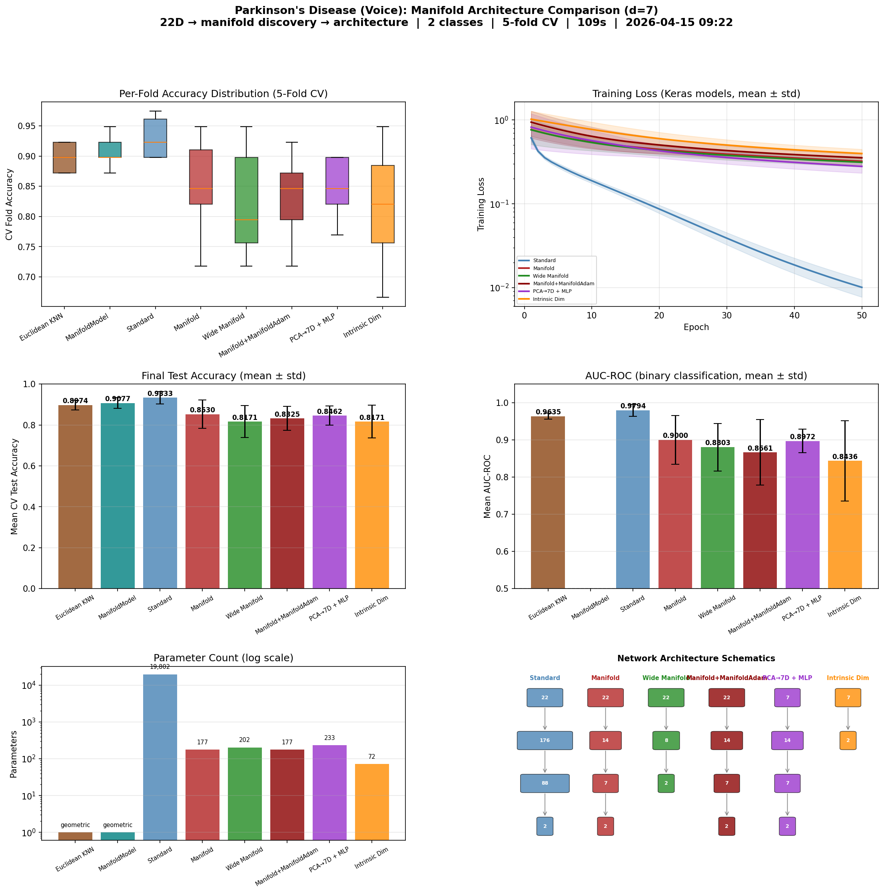

# Manifold-Informed Architecture Benchmark — PARKINSONS

**Generated:** 2026-04-15 09:41:12
**Machine:** Apple M5 Max MacBook Pro, 64 GB RAM, 2TB SSD
**Repository:** waverider @ `054030a` (--abbrev-re
054030a600978c0e9ffac58faf7157939927d009)
**Commit:** 2026-04-14 22:20:05 -0400 — chore(release): bump version to 0.6.0
**Python:** 3.12.13  |  **TensorFlow:** 2.21.0  |  **Device:** CPU (forced)
**Host:** Turing  |  **OS:** macOS-26.4-arm64-arm-64bit

---

## Experimental Setup

| Parameter | Value |
|---|---|
| Dataset | PARKINSONS |
| Input dimensionality | 22 |
| Classes | 2 |
| Intrinsic dim (d) | 7 |
| Variance threshold (τ) | 0.9 |
| Epochs | 50 |
| Trials | 3 |
| Batch size | 32 |
| Learning rate | 0.001 |

## Manifold Discovery

Local PCA over the training set, k=40 neighbors.

| τ | Mean d | Std | Min | Max | Noise % |
|---|---|---|---|---|---|
| 0.95 | 7.9 | 0.8 | 6 | 9 | 64.2% |
| 0.90 | 6.3 | 0.8 | 4 | 8 | 71.5% |
| 0.85 | 5.3 | 0.7 | 4 | 6 | 75.9% |
| 0.80 | 4.6 | 0.5 | 3 | 5 | 79.1% |

### Per-Class Intrinsic Dimensionality

| Class | Mean d | Std | Min | Max |
|---|---|---|---|---|
| 1 | 6.4 | 0.7 | 4 | 7 |
| 0 | 5.3 | 0.4 | 5 | 6 |

## Architecture Comparison

| Architecture | Params | Test Acc (mean ± std) | Test Loss | Acc/Kparam |
|---|---|---|---|---|
| Euclidean KNN (k=7) | 0 | 0.8974 ± 0.0229 | N/A | N/A |
| ManifoldModel (τ=0.9) | 0 | 0.9077 ± 0.0261 | N/A | N/A |
| Standard (176→88) | 19,802 | 0.9333 ± 0.0308 | 0.1964 | 0.0471 |
| Manifold (2d→d, d=7) | 177 | 0.8530 ± 0.0697 | 0.3439 | 4.8192 |
| Wide Manifold (d+1=8) | 202 | 0.8171 ± 0.0783 | 0.3542 | 4.0450 |
| Manifold+ManifoldAdam (d=7) | 177 | 0.8325 ± 0.0591 | 0.3849 | 4.7033 |
| PCA→7D + MLP (2d→d) | 233 | 0.8462 ± 0.0477 | 0.3332 | 3.6316 |
| Intrinsic Dim (PCA→7D→C) | 72 | 0.8171 ± 0.0799 | 0.4188 | 11.3485 |

## Key Findings

- **Best architecture:** Standard (176→88)
  — test accuracy 0.9333 ± 0.0308
- **Manifold compression:** 22D → 7D (68.2% of ambient dimensions are noise)

## Result Figure

