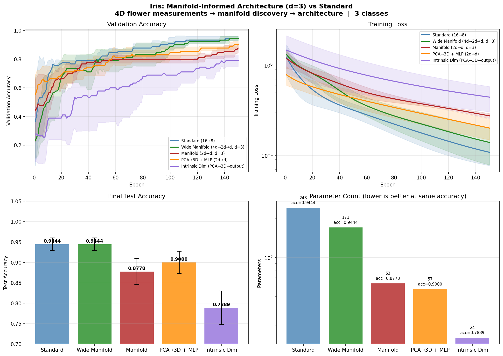

# Manifold-Informed Architecture Benchmark — IRIS

**Generated:** 2026-04-14 20:54:32
**Machine:** Apple M5 Max MacBook Pro, 64 GB RAM, 2TB SSD
**Repository:** waverider @ `4b8002e` (--abbrev-re
4b8002ee9a2e3d56a219d7dab695a80b8efd1e07)
**Commit:** 2026-04-14 20:51:52 -0400 — add: cifar10 results
**Python:** 3.12.13  |  **TensorFlow:** 2.16.2  |  **Device:** CPU (forced)
**Host:** Turing  |  **OS:** macOS-26.4-arm64-arm-64bit

---

## Experimental Setup

| Parameter | Value |
|---|---|
| Dataset | IRIS |
| Input dimensionality | 4 |
| Classes | 3 |
| Intrinsic dim (d) | 3 |
| Variance threshold (τ) | 0.9 |
| Epochs | 150 |
| Trials | 3 |

## Manifold Discovery

Local PCA over the training set, k=not recorded neighbors.

| τ | Mean d | Std | Min | Max | Noise % |
|---|---|---|---|---|---|
| 0.95 | 3.2 | 0.5 | 2 | 4 | 19.0% |
| 0.90 | 2.8 | 0.4 | 2 | 4 | 29.6% |
| 0.85 | 2.5 | 0.5 | 1 | 3 | 38.3% |
| 0.80 | 2.1 | 0.4 | 1 | 3 | 46.2% |

### Per-Class Intrinsic Dimensionality

| Class | Mean d | Std | Min | Max |
|---|---|---|---|---|
| virginica | 2.8 | 0.4 | 2 | 3 |
| setosa | 2.7 | 0.5 | 2 | 3 |
| versicolor | 2.7 | 0.5 | 2 | 3 |

## Architecture Comparison

| Architecture | Params | Test Acc (mean ± std) | Test Loss | Acc/Kparam |
|---|---|---|---|---|
| Standard (16→8) | 243 | 0.9444 ± 0.0157 | 0.1574 | 3.8866 |
| Wide Manifold (4d→2d→d, d=3) | 171 | 0.9444 ± 0.0157 | 0.1817 | 5.5231 |
| Manifold (2d→d, d=3) | 63 | 0.8778 ± 0.0314 | 0.3069 | 13.9330 |
| PCA→3D + MLP (2d→d) | 57 | 0.9000 ± 0.0272 | 0.2405 | 15.7895 |
| Intrinsic Dim (PCA→3D→output) | 24 | 0.7889 ± 0.0416 | 0.4703 | 32.8704 |

## Key Findings

- **Best architecture:** Standard (16→8)
  — test accuracy 0.9444 ± 0.0157
- **Manifold compression:** 4D → 3D (25.0% of ambient dimensions are noise)

## Result Figure

