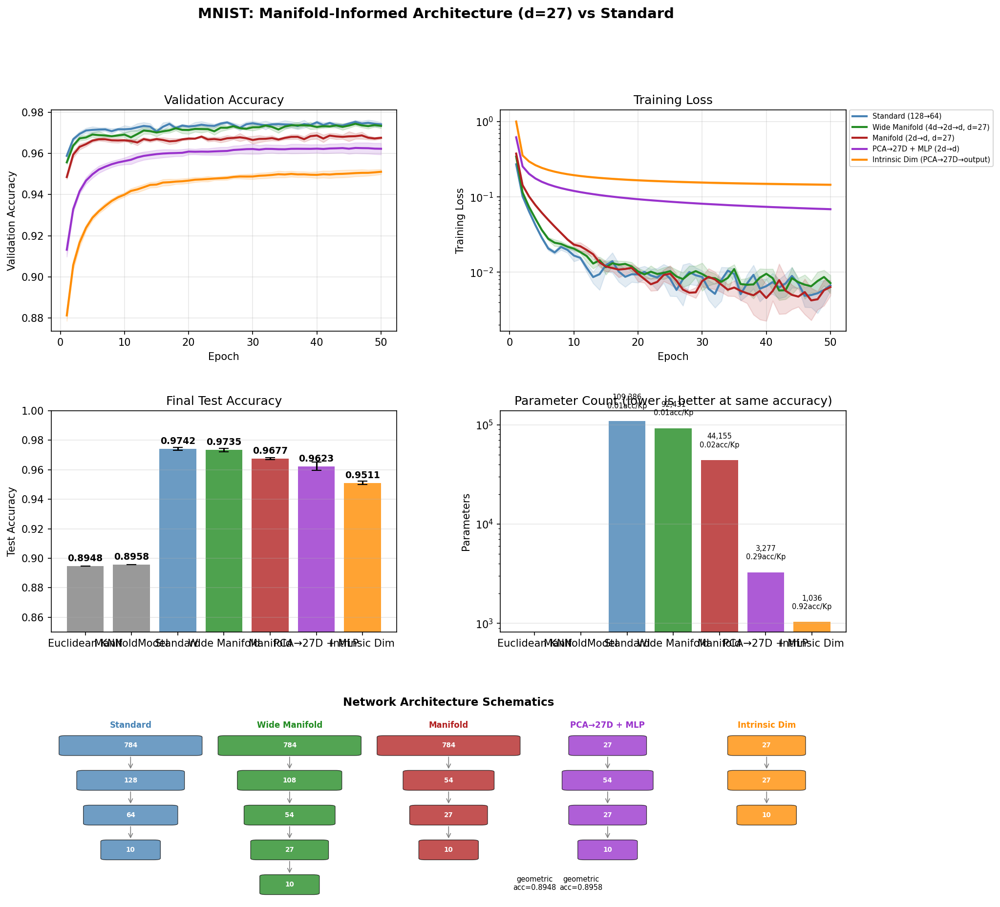

# Manifold-Informed Architecture Benchmark — MNIST

**Generated:** 2026-04-14 20:54:27
**Machine:** Apple M5 Max MacBook Pro, 64 GB RAM, 2TB SSD
**Repository:** waverider @ `4b8002e` (--abbrev-re
4b8002ee9a2e3d56a219d7dab695a80b8efd1e07)
**Commit:** 2026-04-14 20:51:52 -0400 — add: cifar10 results
**Python:** 3.12.13  |  **TensorFlow:** 2.16.2  |  **Device:** CPU (forced)
**Host:** Turing  |  **OS:** macOS-26.4-arm64-arm-64bit

---

## Experimental Setup

| Parameter | Value |
|---|---|
| Dataset | MNIST |
| Input dimensionality | 784 |
| Classes | 10 |
| Intrinsic dim (d) | 27 |
| Variance threshold (τ) | 0.9 |
| Epochs | 50 |
| Trials | 5 |
| Batch size | 128 |
| Learning rate | 0.001 |

## Manifold Discovery

Local PCA over the training set, k=50 neighbors.

| τ | Mean d | Std | Min | Max | Noise % |
|---|---|---|---|---|---|
| 0.95 | 29.7 | 2.9 | 17 | 34 | 96.2% |
| 0.90 | 22.2 | 2.8 | 10 | 27 | 97.2% |
| 0.85 | 17.4 | 2.5 | 7 | 22 | 97.8% |
| 0.80 | 14.1 | 2.3 | 5 | 18 | 98.2% |

### Per-Class Intrinsic Dimensionality

| Class | Mean d | Std | Min | Max |
|---|---|---|---|---|
| Digit 8 | 24.8 | 1.0 | 23 | 27 |
| Digit 3 | 24.2 | 1.5 | 18 | 26 |
| Digit 5 | 23.8 | 2.0 | 16 | 27 |
| Digit 4 | 23.3 | 1.1 | 20 | 25 |
| Digit 2 | 23.0 | 3.4 | 7 | 27 |
| Digit 0 | 22.9 | 1.4 | 18 | 25 |
| Digit 9 | 20.6 | 2.0 | 12 | 23 |
| Digit 6 | 20.6 | 2.9 | 6 | 24 |
| Digit 7 | 19.2 | 2.8 | 11 | 23 |
| Digit 1 | 16.9 | 1.5 | 13 | 20 |

## Architecture Comparison

| Architecture | Params | Test Acc (mean ± std) | Test Loss | Acc/Kparam |
|---|---|---|---|---|
| Euclidean KNN (k=7) | 0 | 0.8948 ± 0.0000 | N/A | N/A |
| ManifoldModel (τ=0.9) | 0 | 0.8958 ± 0.0000 | N/A | N/A |
| Standard (128→64) | 109,386 | 0.9742 ± 0.0010 | 0.3279 | 0.0089 |
| Wide Manifold (4d→2d→d, d=27) | 92,431 | 0.9735 ± 0.0012 | 0.2989 | 0.0105 |
| Manifold (2d→d, d=27) | 44,155 | 0.9677 ± 0.0006 | 0.3700 | 0.0219 |
| PCA→27D + MLP (2d→d) | 3,277 | 0.9623 ± 0.0028 | 0.1430 | 0.2937 |
| Intrinsic Dim (PCA→27D→output) | 1,036 | 0.9511 ± 0.0012 | 0.1655 | 0.9181 |

## Key Findings

- **Best architecture:** Standard (128→64)
  — test accuracy 0.9742 ± 0.0010
- **Manifold compression:** 784D → 27D (96.6% of ambient dimensions are noise)

## Result Figure

