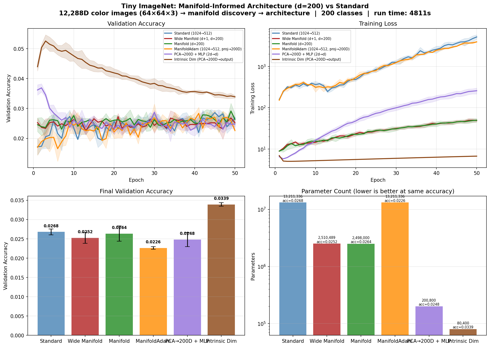

# Manifold-Informed Architecture Benchmark — TINY_IMAGENET

**Generated:** 2026-04-14 20:54:37
**Machine:** Apple M5 Max MacBook Pro, 64 GB RAM, 2TB SSD
**Repository:** waverider @ `4b8002e` (--abbrev-re
4b8002ee9a2e3d56a219d7dab695a80b8efd1e07)
**Commit:** 2026-04-14 20:51:52 -0400 — add: cifar10 results
**Python:** 3.12.13  |  **TensorFlow:** 2.16.2  |  **Device:** GPU
**Host:** Turing  |  **OS:** macOS-26.4-arm64-arm-64bit

---

## Experimental Setup

| Parameter | Value |
|---|---|
| Dataset | TINY_IMAGENET |
| Input dimensionality | 12,288 |
| Classes | 200 |
| Intrinsic dim (d) | 20 |
| Variance threshold (τ) | 0.9 |
| Epochs | 50 |
| Trials | 3 |

## Manifold Discovery

Local PCA over the training set, k=not recorded neighbors.

| τ | Mean d | Std | Min | Max | Noise % |
|---|---|---|---|---|---|
| 0.95 | 19.6 | 0.8 | 17 | 21 | 99.8% |
| 0.90 | 16.6 | 0.9 | 14 | 18 | 99.9% |
| 0.85 | 14.2 | 1.0 | 11 | 16 | 99.9% |
| 0.80 | 12.3 | 1.0 | 9 | 14 | 99.9% |

### Per-Class Intrinsic Dimensionality

*Showing 10 hardest + 10 easiest classes (sorted by mean d)*

| Class | Mean d | Std | Min | Max |
|---|---|---|---|---|
| 146 | 20.0 | 0.0 | 20 | 20 |
| 55 | 19.9 | 0.3 | 19 | 20 |
| 13 | 19.5 | 0.5 | 19 | 20 |
| 99 | 19.5 | 0.5 | 19 | 20 |
| 108 | 19.5 | 0.5 | 19 | 20 |
| 173 | 19.2 | 0.4 | 19 | 20 |
| 90 | 19.1 | 0.3 | 19 | 20 |
| 147 | 19.1 | 0.7 | 18 | 20 |
| 152 | 19.1 | 0.3 | 19 | 20 |
| 16 | 19.0 | 0.4 | 18 | 20 |
| … | … | … | … | … |
| 20 | 15.6 | 1.2 | 14 | 17 |
| 4 | 15.5 | 0.7 | 14 | 16 |
| 179 | 15.5 | 0.8 | 14 | 17 |
| 186 | 15.5 | 0.9 | 14 | 17 |
| 48 | 15.4 | 0.7 | 14 | 16 |
| 161 | 15.2 | 0.9 | 14 | 17 |
| 94 | 15.1 | 0.5 | 14 | 16 |
| 153 | 14.9 | 0.7 | 14 | 16 |
| 116 | 14.7 | 0.5 | 14 | 15 |
| 187 | 14.6 | 1.2 | 13 | 16 |

## Architecture Comparison

| Architecture | Params | Test Acc (mean ± std) | Test Loss | Acc/Kparam |
|---|---|---|---|---|
| Standard (1024→512) | 13,211,336 | 0.0266 ± 0.0010 | 4565.6958 | 0.0000 |
| Wide Manifold (d+1, d=200) | 2,510,489 | 0.0241 ± 0.0019 | 64.0025 | 0.0000 |
| Manifold (d=200) | 2,498,000 | 0.0260 ± 0.0023 | 69.4988 | 0.0000 |
| ManifoldAdam (1024→512, proj→200D) | 13,211,336 | 0.0264 ± 0.0008 | 3297.0621 | 0.0000 |
| PCA→200D + MLP (2d→d) | 200,800 | 0.0279 ± 0.0025 | 228.4910 | 0.0001 |
| Intrinsic Dim (PCA→200D→output) ✦ | 80,400 | 0.0336 ± 0.0012 | 6.8843 | 0.0004 |

## Key Findings

- **Best architecture:** Intrinsic Dim (PCA→200D→output)
  — test accuracy 0.0336 ± 0.0012
- **vs Standard:** +0.0070 (0.70 pp) accuracy gain
- **Parameter reduction:** 164.3× fewer parameters (80,400 vs 13,211,336)
- **Parameter efficiency:** 0.0004 acc/Kparam vs 0.0000 for Standard (207.8× improvement)
- **Manifold compression:** 12,288D → 20D (99.8% of ambient dimensions are noise)

## Result Figure

