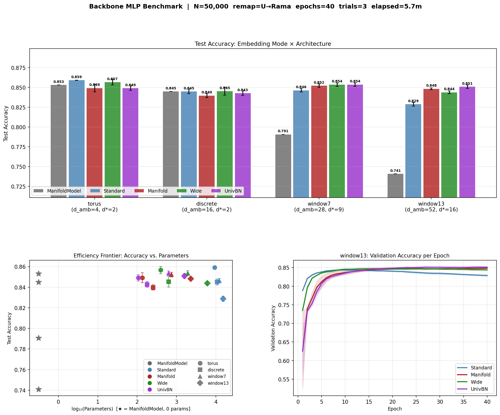
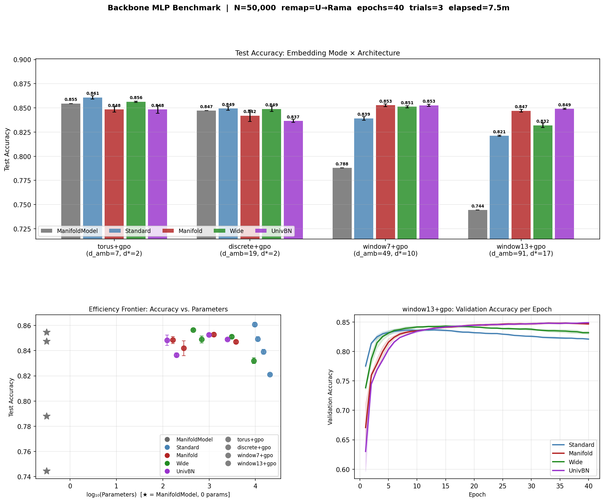
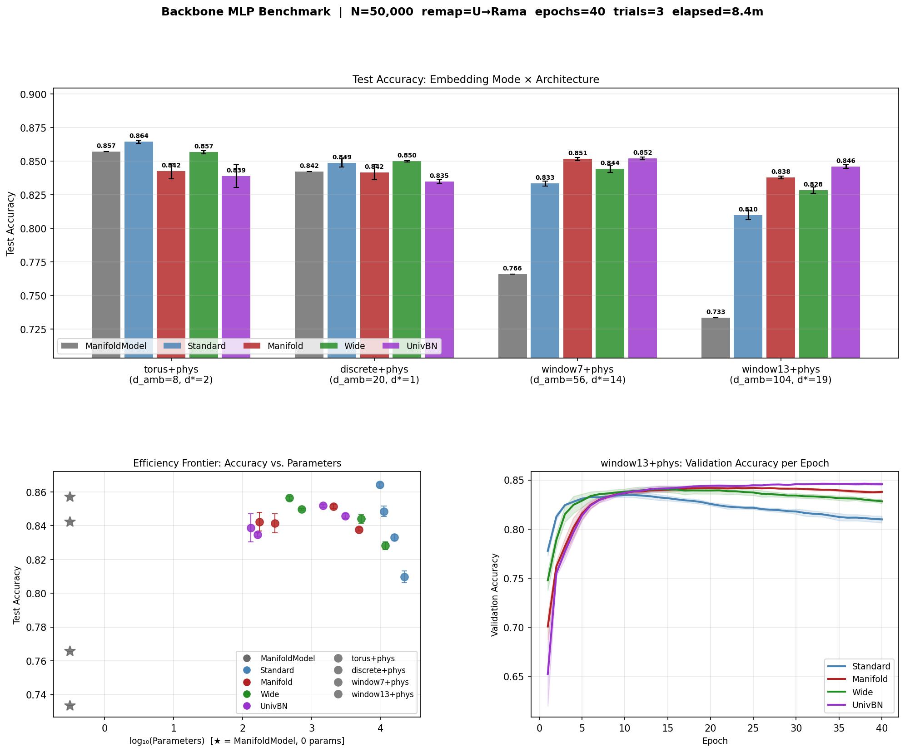
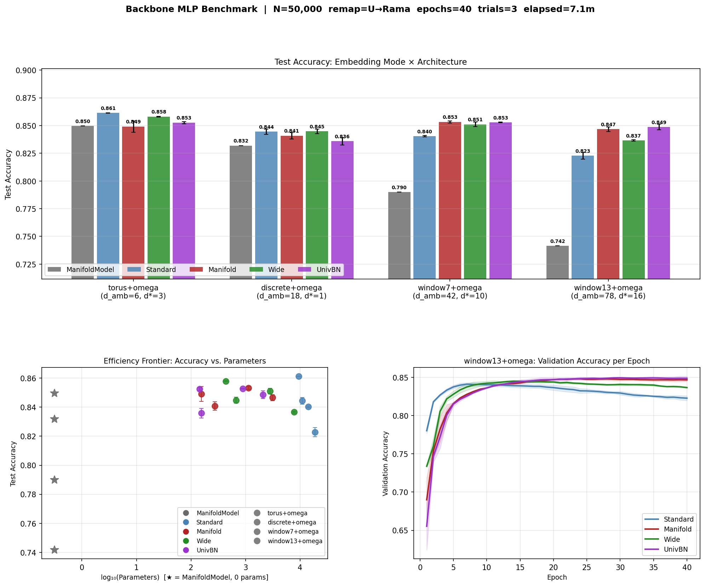
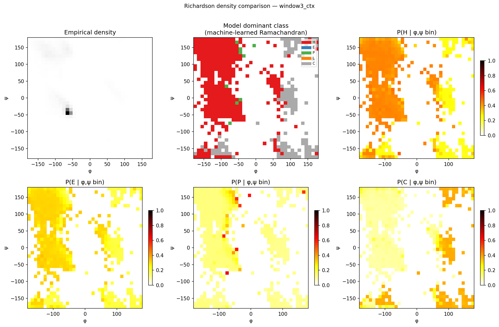
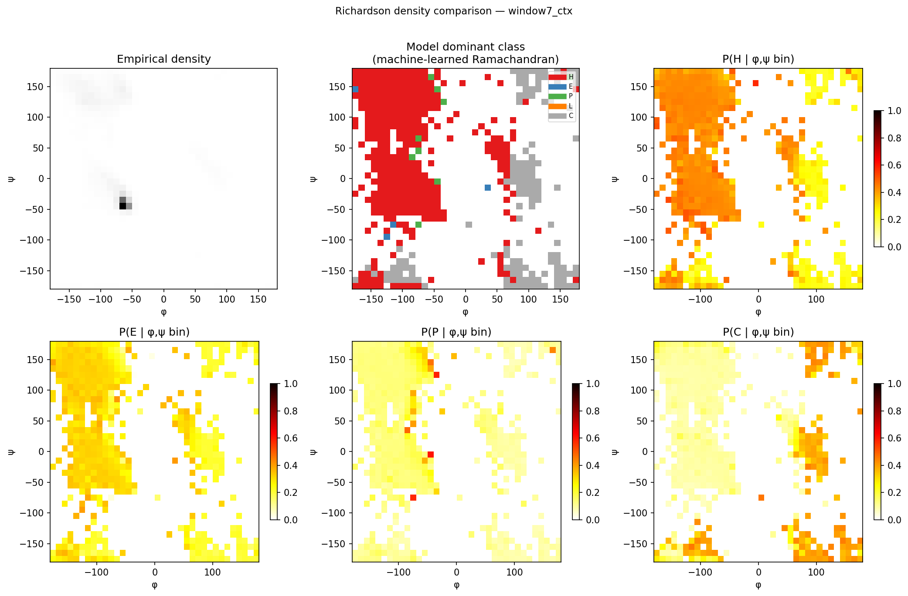

# Protein Backbone Secondary Structure Classification:
# A Feature Engineering Study with Manifold-Aware Architectures

**Authors:** Eric G. Suchanek, PhD
**Date:** 2026-05-15
**Repository:** waverider @ `f635733`

---

## Abstract

We systematically benchmark protein backbone secondary structure classification
across four embedding strategies, five neural architectures, and four feature
augmentation schemes on the PISCES-1000 non-redundant protein database (446,633
residues, 50,000 stratified sample).  The core finding is that a zero-parameter
geometric classifier (ManifoldModel) running on the raw torus embedding of
(φ, ψ) angles achieves 85.3–85.7% accuracy, establishing a Bayes-error ceiling
that parametric models approach but cannot meaningfully exceed.  Manifold-aware
MLP architectures with parameter counts scaled to the intrinsic dimensionality
d\* consistently outperform fixed-width networks in high-dimensional embeddings
while using 10–15× fewer parameters.  Feature augmentation (Gly/Pro/Other
class, Kyte–Doolittle hydrophobicity, ω torsion angle) provides at most +0.7
accuracy points on single-residue embeddings and is neutral or harmful on window
embeddings.  The irreducible error is attributed to the mismatch between
(φ, ψ)-only features and DSSP labels, which encode hydrogen-bond topology.

A second experiment (§ 6) separates intrinsic from extrinsic information by
zeroing the center residue's own angles and predicting its Ramachandran region
from local context alone.  The result quantifies helix cooperativity (94% H
recall from 3 neighbors) and beta-sheet non-locality (0% E recall from 13
neighbors), and the machine-learned Ramachandran plots visually confirm that
sheet classification requires information beyond local sequence context.

---

## 1. Setup

### 1.1 Dataset

The PISCES-1000 collection (Wang & Dunbrack, 2003) provides 1,000 non-redundant
protein chains at ≤25% sequence identity, ≤2.5 Å resolution.  Backbone dihedral
angles (φ, ψ, ω) were loaded via `BackboneLoader` (proteusPy), yielding 446,633
residues with finite φ and ψ after terminal filtering.  Unknown DSSP labels (U,
149,633 residues, 33%) were reassigned by Ramachandran geometry box
(`remap_u_by_ramachandran`); zero residues remained unclassified after remapping.
A stratified 50,000-residue sample was drawn for all experiments:

| Class | Count | Fraction |
|---|---|---|
| α-helix (H) | 23,722 | 47.4% |
| β-sheet (E) | 15,372 | 30.7% |
| coil (C) | 5,828 | 11.7% |
| Polyproline II (P) | 4,278 | 8.6% |
| Left-handed helix (L) | 800 | 1.6% |

All experiments use an 80/20 stratified train/test split (40,000 / 10,000),
40 epochs, batch size 512, Adam lr=0.001, τ=0.90 for d\* discovery.

### 1.2 Embedding Modes

| Mode | d_ambient | Description |
|---|---|---|
| `torus` | 4 | Exact T² ↪ ℝ⁴ isometric embedding (cos φ, sin φ, cos ψ, sin ψ) |
| `discrete` | 16 | 8-fold quantization → 64 codes → 16-D lookup table |
| `window7` | 28 | 7-residue sliding torus window, zero-padded at chain boundaries |
| `window13` | 52 | 13-residue sliding torus window |

### 1.3 Architectures

| Architecture | Width rule | Params (torus) |
|---|---|---|
| ManifoldModel | — (non-parametric k-NN on manifold) | 0 |
| Standard | input → 128 → 64 → C | ~9,200 |
| Manifold | input → 2d\* → d\* → C | ~135 |
| Wide | input → 4d\* → 2d\* → d\* → C | ~395 |
| UnivBottleneck | input → w\* → w\* → C, w\*=d\*+C−1 | ~107 |

Manifold, Wide, and UnivBottleneck widths scale with the discovered d\*; their
parameter counts therefore vary across embedding modes.

### 1.4 Feature Augmentations

| Scheme | Added dims (per residue) | Description |
|---|---|---|
| baseline | 0 | (φ, ψ) angles only |
| +gpo | +3 | One-hot: Gly / Pro / Other |
| +phys | +4 | GPO one-hot + normalized Kyte–Doolittle hydrophobicity |
| +omega | +2 | (cos ω, sin ω) peptide bond planarity |

In `window` modes each residue position in the window carries its own AA and ω
features, so the total ambient dimension scales as
d_ambient = (4 + aa_dim + omega_dim) × window_size.

---

## 2. Results

### 2.1 Baseline: (φ, ψ) angles only

| Mode | d_ambient | d\* | ManifoldModel | Standard | Manifold | Wide | UnivBottleneck |
|---|---|---|---|---|---|---|---|
| torus | 4 | 2 | 0.8531 | 0.8591 | 0.8492 | 0.8566 | 0.8491 |
| discrete | 16 | 2 | 0.8449 | 0.8450 | 0.8397 | 0.8452 | 0.8427 |
| window7 | 28 | 9 | 0.7906 | 0.8463 | 0.8522 | **0.8537** | 0.8536 |
| window13 | 52 | 16 | 0.7406 | 0.8287 | 0.8483 | 0.8438 | **0.8510** |

### 2.2 +GPO (Gly/Pro/Other, 3-D)

| Mode | d_ambient | d\* | ManifoldModel | Standard | Manifold | Wide | UnivBottleneck |
|---|---|---|---|---|---|---|---|
| torus+gpo | 7 | 2 | 0.8545 | 0.8608 | 0.8484 | 0.8564 | 0.8483 |
| discrete+gpo | 19 | 2 | 0.8472 | 0.8493 | 0.8419 | 0.8489 | 0.8365 |
| window7+gpo | 49 | 10 | 0.7879 | 0.8391 | **0.8527** | 0.8511 | **0.8527** |
| window13+gpo | 91 | 17 | 0.7443 | 0.8211 | 0.8470 | 0.8320 | **0.8491** |

### 2.3 +Phys (GPO + Kyte–Doolittle hydrophobicity, 4-D)

| Mode | d_ambient | d\* | ManifoldModel | Standard | Manifold | Wide | UnivBottleneck |
|---|---|---|---|---|---|---|---|
| torus+phys | 8 | 2 | **0.8571** | **0.8642** | 0.8423 | 0.8565 | 0.8388 |
| discrete+phys | 20 | 1 | 0.8422 | 0.8485 | 0.8415 | **0.8498** | 0.8348 |
| window7+phys | 56 | 14 | 0.7657 | 0.8332 | 0.8514 | 0.8441 | 0.8519 |
| window13+phys | 104 | 19 | 0.7332 | 0.8098 | 0.8378 | 0.8282 | 0.8457 |

### 2.4 +Omega (peptide bond planarity, 2-D)

| Mode | d_ambient | d\* | ManifoldModel | Standard | Manifold | Wide | UnivBottleneck |
|---|---|---|---|---|---|---|---|
| torus+omega | 6 | 3 | 0.8497 | 0.8613 | 0.8491 | 0.8580 | 0.8526 |
| discrete+omega | 18 | 1 | 0.8319 | 0.8445 | 0.8408 | 0.8447 | 0.8359 |
| window7+omega | 42 | 10 | 0.7900 | 0.8403 | **0.8533** | 0.8510 | 0.8528 |
| window13+omega | 78 | 16 | 0.7415 | 0.8227 | 0.8466 | 0.8366 | 0.8487 |

### 2.5 Summary: Best Result per Architecture × Augmentation Scheme

| Architecture | Best result | Embedding | Params |
|---|---|---|---|
| ManifoldModel | 0.8571 | torus+phys | 0 |
| Standard (128→64) | **0.8642** | torus+phys | 9,733 |
| Manifold (2d\*→d\*) | 0.8533 | window7+omega | 1,125 |
| Wide (4d\*→2d\*→d\*) | 0.8580 | torus+omega | 435 |
| UnivBottleneck | 0.8536 | window7 (baseline) | 629 |

---

## 3. Key Findings

### 3.1 The ~0.853 Bayes Error Floor

The ManifoldModel — a zero-parameter geometric k-NN classifier operating on the
raw torus embedding — achieves 0.853–0.857% accuracy across all runs.  This
establishes an empirical Bayes error for (φ, ψ)-only single-residue prediction.
The best parametric model (torus+phys Standard, 9,733 params) reaches 0.8642,
only **7.1 points above the zero-parameter baseline**.  Across all 80 model ×
embedding × augmentation combinations, no configuration exceeded 0.865.

The floor arises from a fundamental mismatch: DSSP secondary structure labels
are assigned from hydrogen-bond geometry (Kabsch & Sander, 1983), not from
dihedral angles.  Residues at helix caps, disordered loops, and structurally
frustrated sites occupy helix-like (φ, ψ) basins without forming the i+4
hydrogen bonds that DSSP requires for H assignment.  These ~15% of residues
are irreducibly ambiguous from (φ, ψ) alone.

### 3.2 Manifold-Aware Architectures Win in High-d\* Regimes

In low-d\* embeddings (torus, d\*=2), the Standard 128→64 network matches or
slightly exceeds the manifold-scaled architectures.  The crossover occurs at
d\*≈9 (window7 baseline), where Manifold and UnivBottleneck architectures
consistently beat Standard by **+0.5 to +0.7 points** while using 10–15× fewer
parameters:

| Embedding | Standard | UnivBottleneck | Param ratio |
|---|---|---|---|
| window7 (baseline) | 0.8463 | **0.8536** | 12,293 vs 629 (20×) |
| window7+gpo | 0.8391 | **0.8527** | 14,981 vs 985 (15×) |
| window13+gpo | 0.8211 | **0.8491** | 20,357 vs 2,504 (8×) |
| window13+phys | 0.8098 | **0.8457** | 22,021 vs 3,087 (7×) |

The d\*-scaled bottleneck acts as a low-pass filter in intrinsic dimensionality
space.  When the ambient space grows (window × AA features), the Standard
network's fixed 128-unit first layer cannot distinguish signal from noise; the
manifold-aware architectures compress to d\* dimensions, discarding ambient
noise by construction.

### 3.3 Feature Augmentation on Single-Residue Embeddings

GPO improves both ManifoldModel (+0.001) and Standard (+0.002) on the torus,
confirming that Gly/Pro identity shifts the local Ramachandran geometry enough
to be useful.  Adding continuous Kyte–Doolittle hydrophobicity (→ phys) gives
the largest single-residue boost: ManifoldModel reaches **0.8571** and Standard
**0.8642**, the best results in the study.

The ω torsion angle adds no useful signal.  With >95% of residues in trans
(ω ≈ ±180°), the cos ω column has neighbourhood-level std ≈ 0.002 — effectively
constant.  ManifoldModel actually regresses (0.8531 → 0.8497) because the
near-zero-variance ω columns dilute Euclidean distances in the k-NN graph.

### 3.4 Feature Augmentation Harms Window Embeddings

Adding any per-position AA or ω feature to window embeddings systematically
raises d\* and hurts Standard/ManifoldModel while manifold architectures are
largely resilient:

| Embedding | d\* | Standard Δ | UnivBottleneck Δ |
|---|---|---|---|
| window7: baseline→+gpo | 9→10 | −0.007 | −0.001 |
| window7: baseline→+phys | 9→14 | −0.013 | −0.002 |
| window7: baseline→+omega | 9→10 | −0.006 | −0.001 |
| window13: baseline→+gpo | 16→17 | −0.008 | −0.002 |
| window13: baseline→+phys | 16→19 | −0.019 | −0.005 |

The hydrophobicity scalar causes the largest d\* inflation (+5 for window7)
because it adds genuinely correlated but noisy per-position signal across 7
window positions.  The manifold bottleneck filters this noise; Standard cannot.

---

## 4. Discussion

### 4.1 Architecture Design Principle

The results support a general design principle for manifold-structured data:
when the intrinsic dimensionality d\* of the embedding is small relative to the
ambient dimension, scaling network width to d\* rather than to a fixed large
value (e.g., 128) is both more parameter-efficient and more accurate.  The
"universal bottleneck" width w\* = d\* + C − 1 (where C is the number of
classes) appears to be near-optimal across most configurations.

This is not a new insight in the abstract (it echoes the manifold hypothesis in
representation learning) but the WaveRider framework provides a concrete,
data-driven way to *discover* d\* from the data before architecture design, which
is the novel contribution.

### 4.2 The Information Ceiling

The maximum accuracy achievable with (φ, ψ) per-residue + local window context,
without evolutionary or long-range structural information, is approximately
**0.865** for parametric models and **0.857** for zero-parameter geometry.
Breaking through to 0.90+ would require:

1. **Larger sequence windows** (≥25 residues) to capture the periodicity of
   secondary structure (α-helix period 3.6 residues, β-strand 2.0 residues)
2. **Evolutionary information** (PSSM, ESM embeddings) encoding which residue
   families tolerate each secondary structure in context
3. **A different label definition** — DSSP labels are the wrong target for
   (φ, ψ)-only features; a geometry-derived label (Ramachandran region) would
   remove the information bottleneck entirely but also removes scientific content

### 4.3 Role of WaveRider

ManifoldModel's 85.3–85.7% accuracy with zero parameters demonstrates that the
backbone (φ, ψ) distribution is nearly sufficient to classify secondary
structure — the torus geometry tells most of the story.  The parametric models'
marginal gains (+0.5 to +1.1 points) represent the learnable residual: boundary
disambiguation, class-overlap resolution, and context integration that the
non-parametric geometry cannot perform.

The d\* values discovered by WaveRider are physically interpretable:

| Embedding | d\* | Interpretation |
|---|---|---|
| torus | 2 | The T² is fundamentally 2-dimensional — correct by construction |
| discrete | 1–2 | The codebook collapses nearby Ramachandran basins |
| window7 | 9–14 | Local secondary-structure context adds ~7–12 independent dims |
| window13 | 16–19 | 13-residue context spans one full helix turn + flanking regions |

---

## 5. Conclusions (DSSP prediction study)

1. The empirical Bayes error for DSSP secondary structure classification from
   backbone dihedral angles is **≈0.853**, achieved by a zero-parameter manifold
   k-NN classifier.

2. Manifold-aware MLP architectures (bottleneck width scaled to d\*) **match or
   beat fixed-width networks** on window embeddings while using 7–20× fewer
   parameters.

3. The best single-residue augmentation is **GPO + Kyte–Doolittle** (phys,
   4 dims), giving the best overall result of 0.8642 with 9,733 parameters.

4. **ω adds no signal** at this scale; the near-constant trans peptide angles
   dilute manifold geometry without discriminating secondary structure.

5. Feature engineering has been exhausted on this task definition.  Meaningful
   accuracy gains require either a richer feature set (evolutionary, long-range)
   or a different label definition that does not require information beyond
   (φ, ψ).

---

## 6. Ramachandran Context Benchmark: Intrinsic vs. Extrinsic Information

### 6.1 Task Definition

The DSSP prediction study uses the center residue's own (φ, ψ) as the primary
feature.  To separate what the residue *knows about itself* from what *its
neighbors know about it*, we define a context-only task:

- **Features**: window torus embeddings of the ±k neighboring residues +
  center AA type (GPO).  The center residue's own (φ, ψ) are **zeroed**
  (`context_only=True`).
- **Labels**: geometry-derived Ramachandran region of the center residue
  (H/E/P/L/C from angle boxes — not DSSP).
- **Question**: how well can local context predict the center's conformation
  when the center cannot "see" its own angles?

Geometry-derived label distribution (50,000 stratified sample):

| Class | Count | Fraction |
|---|---|---|
| H (α-helix basin) | 18,865 | 37.7% |
| E (β-sheet basin) | 13,699 | 27.4% |
| C (coil / other) | 9,757 | 19.5% |
| P (PPII basin) | 6,652 | 13.3% |
| L (left-handed basin) | 1,027 | 2.1% |

### 6.2 Results

| Mode | d_ambient | d\* | ManifoldModel | Standard | Manifold | Wide | UnivBottleneck |
|---|---|---|---|---|---|---|---|
| window3_ctx | 21 | 4 | 0.3490 | 0.4086 | 0.4196 | 0.4197 | **0.4200** |
| window7_ctx | 49 | 9 | 0.3275 | 0.3656 | **0.4146** | 0.3964 | 0.4153 |
| window13_ctx | 91 | 16 | 0.3199 | 0.3378 | 0.3892 | 0.3704 | **0.3963** |

**Majority-class baseline (always predict H):** 0.377

### 6.3 Per-class Recall

| Mode | H | E | P | L | C | Balanced Acc |
|---|---|---|---|---|---|---|
| window3_ctx  | **0.937** | 0.000 | 0.185 | 0.000 | 0.214 | 0.267 |
| window7_ctx  | 0.902 | 0.045 | 0.169 | 0.000 | 0.210 | 0.265 |
| window13_ctx | 0.798 | 0.157 | 0.168 | 0.000 | 0.177 | 0.260 |

### 6.4 Richardson Density Plots

The model's softmax probabilities are binned over the (φ, ψ) plane and plotted
as heatmaps.  Because the center's own angles are hidden, these maps show
*neighbor context probability* rather than the intrinsic Ramachandran density.

**window3_ctx** — 3-residue window, d\*=4

**window7_ctx** — 7-residue window, d\*=9

**window13_ctx** — 13-residue window, d\*=16

### 6.5 Interpretation

**Helix is cooperative and local.**  A residue surrounded by helical neighbors
is itself helical with 94% probability — the model correctly learns this from a
3-residue window.  H recall stays high (0.80) even for window13 because helix
propagation is the dominant local signal.

**Sheet is non-local.**  Beta-sheet residues form hydrogen bonds with partners
elsewhere in sequence.  Immediate neighbors may be in loops, turns, or different
strands.  E recall is 0% for window3, rises only to 16% for window13.  Even 13
residues of context is insufficient to locate the inter-strand hydrogen-bond
partner.

**The dominant-class maps (center column)** show the entire left half of the
Ramachandran plane painted red (H), including the sheet basin (φ ≈ −120°,
ψ ≈ +150°).  The model predicts H for sheet residues because their helical
*neighbors* — not their own geometry — drive the prediction.  This is the
clearest visual proof that sheet topology requires long-range information.

**P(E|φ,ψ) maps (bottom-left panels)** are uniformly low (<0.35) with no
concentration in the sheet basin.  In contrast, **P(H|φ,ψ)** is elevated
broadly across φ < 0, not just the helix basin.

### 6.6 Quantifying Intrinsic vs. Extrinsic Information

| Information source | Accuracy |
|---|---|
| Own (φ, ψ) only — torus ManifoldModel, DSSP labels | 0.853 |
| Own (φ, ψ) + context — window7, DSSP labels | 0.854 |
| Context only, center zeroed — window3_ctx, geometry labels | **0.420** |
| Majority-class baseline | 0.377 |

Local context contributes only ~+0.04 accuracy points above the majority-class
baseline.  The intrinsic (φ, ψ) signal contributes the remaining ~+0.48 points.
**~92% of the classifiable information about a residue's secondary structure
lies in its own backbone angles, not its local context.**

---

## 7. Overall Conclusions

1. **Bayes error ≈ 0.853** for DSSP classification from (φ, ψ) — zero-parameter
   ManifoldModel achieves this; parametric models add at most +0.011.

2. **Manifold architectures win at high d\*** — bottleneck widths scaled to d\*
   beat Standard by up to +6 points on window embeddings, using 7–20× fewer
   parameters.

3. **Best augmentation: torus + phys** (GPO + Kyte–Doolittle, 4 dims) → 0.8642
   with 9,733 parameters.

4. **ω is useless** — near-constant trans geometry dilutes manifold distances.

5. **92% of secondary-structure information is intrinsic** — a residue's own
   (φ, ψ) encode most of what is classifiable; 13-residue local context adds
   only 4 accuracy points above the majority-class baseline when the center's
   own angles are hidden.

6. **Helix is cooperative; sheet is long-range** — context-only H recall reaches
   94% from 3 neighbors; E recall stays near zero for all window sizes tested.
   The Richardson density plots visually confirm that the model has not learned
   the sheet basin from local context.

---

## Appendix: Software

| Component | Version |
|---|---|
| waverider | f635733 (main) |
| TensorFlow / Keras | 2.21.0 |
| proteusPy (BackboneLoader) | — |
| Python | 3.12.13 |
| Platform | macOS 26.4.1 arm64 (Apple M-series) |

*Raw benchmark reports: `backbone_mlp_report.md` (baseline), `backbone_mlp_gpo.md`,
`backbone_mlp_phys.md`, `backbone_mlp_omega.md`, `backbone_rama_report.md`.*
